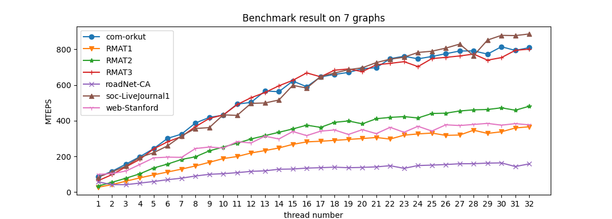
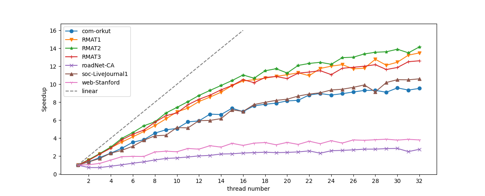

# ParallelBFS

Lab1 of Parallel Computing: a simple parallel BFS on graph implemented by C++ with OpenMP.

The algorithm is tested on several graphs and measured by MTEPS. The speed up is also shown as in figure2.

